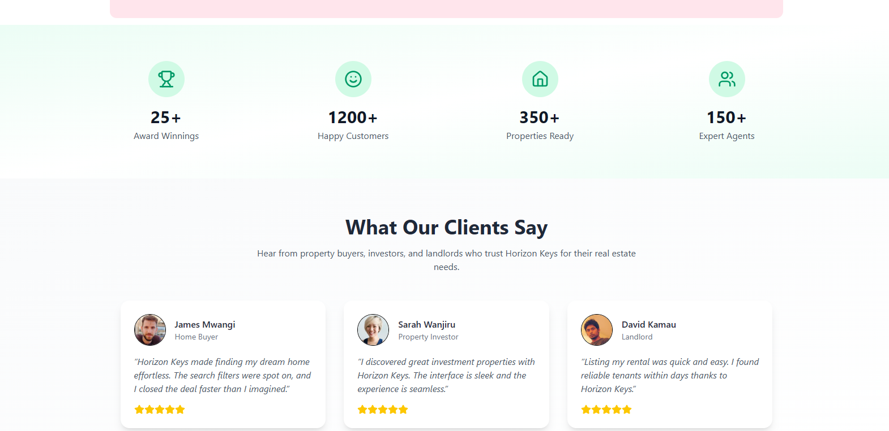
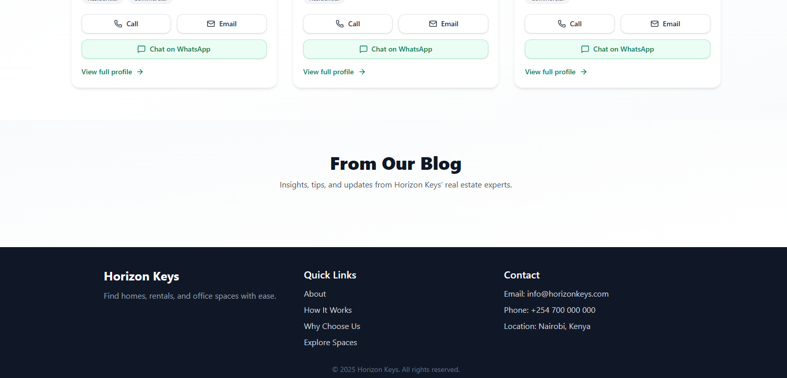
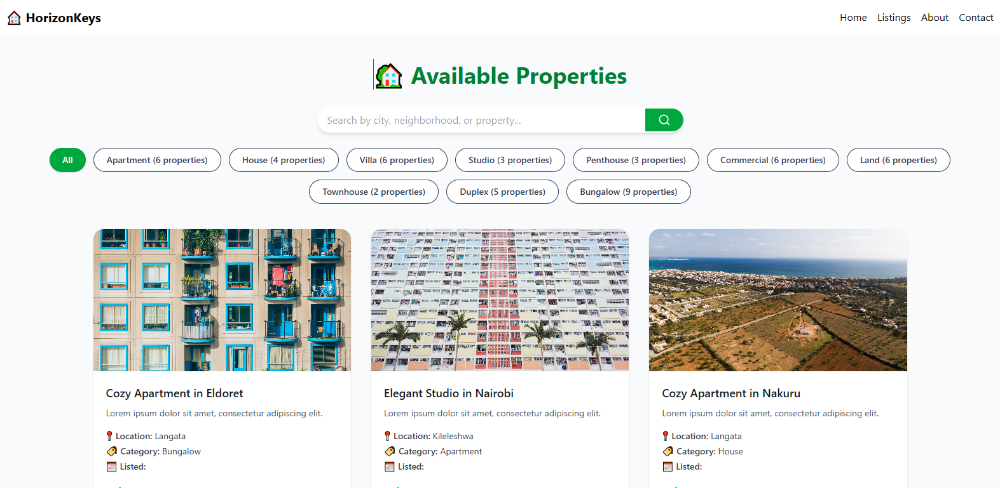
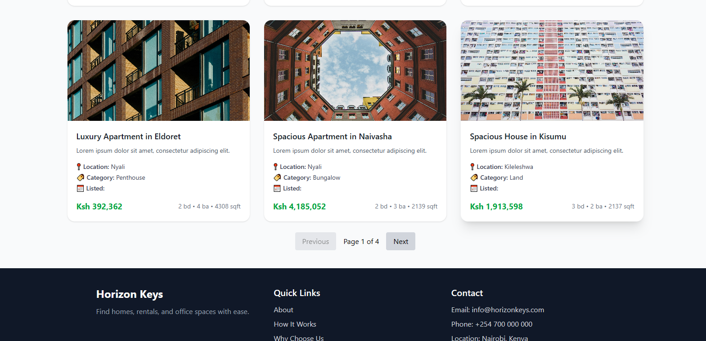

# 🏡 Horizonkeys — Home Decor & Furnishings E-commerce Platform

[](https://github.com/banju-che/aestivo/actions)


---

Horizonkeys is a beautifully designed full-stack e-commerce platform focused on home décor and furnishings.
It offers a seamless shopping experience with elegant product displays, secure checkout, and smooth performance across devices.
Built with scalability and modern design principles in mind, Horizonkeys brings together functionality and aesthetics to create a platform that feels both modern and user-friendly.

---

## 🚀 Features

🛍️ Frontend
  - Modern React UI built with Vite
  - Styled with TailwindCSS
  - Product search, filtering, sorting & pagination
  - Responsive and mobile-first design
  - Toast notifications for cart & checkout actions


⚙️ Backend

  - RESTful API built with Django REST Framework
  - JWT Authentication with Djoser
  - Cloudinary image upload & management
  - M-Pesa STK Push integration (Sandbox + Live)
  - PostgreSQL database for production
  - Custom admin panel for product & order management


🐳 DevOps

  - Dockerized backend & frontend
  - Docker Compose for multi-container setup
  - Environment-based configuration using `.env`
  - Ready for Render or VPS deployment


---

## 🛠️ Tech Stack

| Layer       | Technology                                      |
|--------------|-------------------------------------------------|
| Frontend     | React (Vite), TailwindCSS, Axios, React Router |
| Backend      | Django, Django REST Framework, Djoser, JWT     |
| Database     | PostgreSQL (SQLite for local dev)              |
| Media        | Cloudinary CDN                                 |
| Container    | Docker, Docker Compose                         |
| Deployment   | Render / Linux (Ubuntu)                        |

---

## 📂 Project Structure
```
Horizonkeys/
│
├── backend/
│ ├── manage.py
│ ├── api/ # API endpoints
│ ├── users/ # Authentication app
│ ├── products/ # Product app
│ ├── orders/ # Order & payment app
│ ├── settings.py
│ └── requirements.txt
│
├── frontend/
│ ├── src/
│ │ ├── components/
│ │ ├── pages/
│ │ ├── contexts/
│ │ ├── services/
│ │ └── App.jsx
│ ├── package.json
│ └── vite.config.js
│
├── docker-compose.yml
├── Dockerfile
├── .env.example
└── README.md

yaml
Copy code
```
---

## ⚡ Getting Started

### 1️⃣ Clone the Repository
```bash
git clone https://github.com/banju-che/aestivo.git
cd aestivo
```
### 2️⃣ Configure Environment Variables
Create a .env file in the backend directory:
```
ini
Copy code
SECRET_KEY=your_django_secret_key
DEBUG=True
DATABASE_URL=postgres://user:password@db:5432/aestivo_db

```
### 🐳 Run with Docker
```
bash
Copy code
docker-compose up --build
```
Frontend: http://localhost:5173

Backend API: http://localhost:8000

To run in detached mode:
```
bash
Copy code
docker-compose up -d
```
### ⚙️ Manual Setup (Without Docker)
Backend
```
bash
Copy code
cd backend
python -m venv venv
source venv/bin/activate   # On Linux/Mac
venv\Scripts\activate      # On Windows

pip install -r requirements.txt
python manage.py migrate
python manage.py runserver
```
Frontend
```
bash
Copy code
cd frontend
npm install
npm run dev
```
### 🔗 API Endpoints
🪑 Products
```
Method	Endpoint	Description
GET	/api/products/	List all products
POST	/api/products/	Add a new product
GET	/api/products/:id/	Retrieve a product
PUT	/api/products/:id/	Update a product
DELETE	/api/products/:id/	Delete a product
```
### 💳 Orders
```
Method	Endpoint	Description
GET	/api/orders/	List all orders
POST	/api/orders/	Create a new order
```
## 🧾 M-Pesa Integration
Aestivo integrates Safaricom’s M-Pesa Daraja API to enable seamless mobile payments via STK Push.
Payment confirmations and callbacks are logged and verified on the backend for secure order tracking.

## ☁️ Cloudinary Integration
All product images are uploaded to Cloudinary, leveraging their CDN for optimized performance and automatic image compression.

## 📸 Screenshots
🏠 Homepage

  

  

  

  

  

  

💳 Properties List

  

  

## 🧪 Running Tests
```
bash
Copy code
python manage.py test
```
## 🚀 Deployment
🔗 Live Demo: Aestivo on Render

## 🐳 Docker Images:

Backend: ghcr.io/juliusgacheru/aestivo-backend:latest

Frontend: ghcr.io/juliusgacheru/aestivo-frontend:latest

## 👤 Author

Julius Gacheru

📍 Nairobi, Kenya

📧 juliusgacheru021@gmail.com

🔗 LinkedIn | GitHub

### 🧠 Developer Notes
Built with clean, modular Django + React architecture

Docker-ready for deployment on any Linux server

Great for portfolio, freelance, or real-world e-commerce deployment

💡 “Aestivo — because every space deserves elegance.”
---
